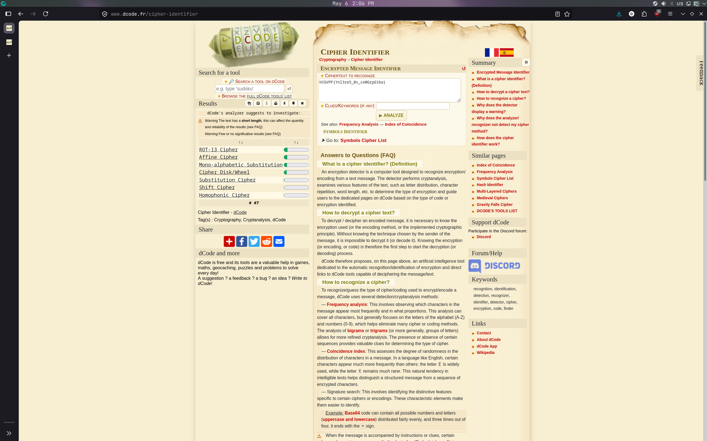
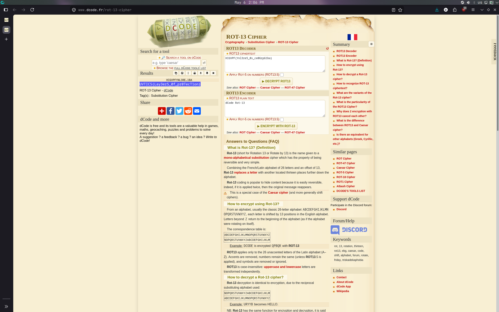

# Solution: Binwalking through an Onion

## 1. Type Identification
We are given a file named `BigOnion.png`. Following the hint in the title, we start by analyzing the image using `binwalk` to see if there are any hidden files appended to it.

```bash
binwalk BigOnion.png
```

The output reveals that a ZIP archive is hidden inside the PNG file. 

## 2. Extraction
Since we know there is a ZIP archive embedded in the file, we can extract its contents directly using the `unzip` command:

```bash
unzip BigOnion.png
```

This successfully extracts a file named `flag.txt`.

## 3. Cipher Identification
Reading `flag.txt` reveals a string of text that looks like a flag, but the characters are scrambled. To figure out the encoding, we copy the contents and paste them into the **dCode Cipher Identifier**.

The tool analyzes the text and suggests that it is encrypted using a **ROT cipher** (Caesar cipher).



## 4. Decoding the Flag
Next, we take the scrambled text over to the **dCode ROT Cipher decoder**.

The decoder successfully decrypts the text, revealing the plaintext flag.




**Flag:** `UVTICS{Lay3er5_0f_pr0TecT1on}` 

