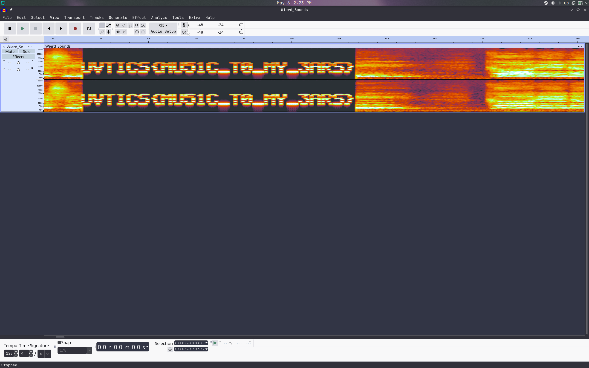

# Solution: Fix my song!

## 1. Step 1
My first tought was to open the file using **Audacity**, a popular open-source audio editor.

## 2. Spectrogram View
Audio steganography often hides data in the frequency spectrum of the sound rather than the audio itself. To view this, I change the track display from the default Waveform to a **Spectrogram**.
Immediately after switching views, I can observe a blocky pattern appearing within the audio frequencies.
By zooming in, I notice the text becomes perfectly readable, revealing the hidden flag.

**Flag:** `UVTICS{MU51C_T0_MY_3ARS}` 