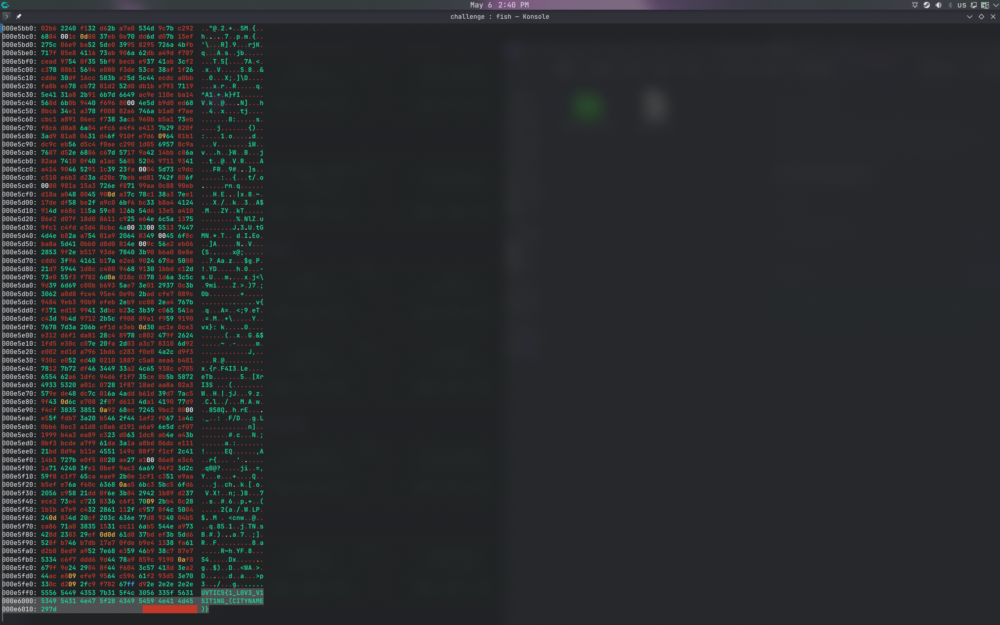
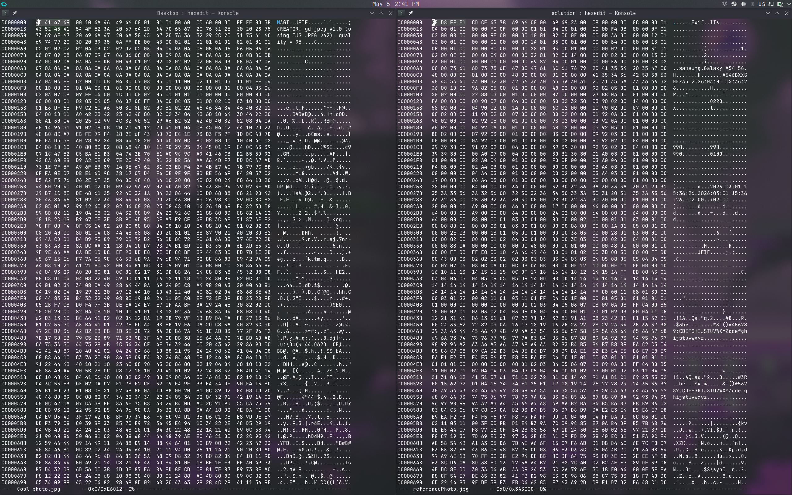
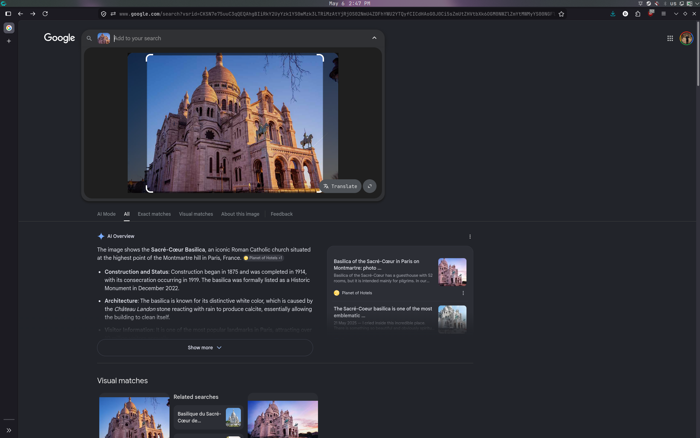

# Solution: I know this place!

First, I inspected the hexdump of the image using the command `xxd Cool_photo.jpg`. At the bottom, I found a partial flag: `UVTICS{1_L0V3_V1SIT1NG_(CITYNAME)}`. 

I then tried to fix the photo to get the city name.

I used `hexedit` on both `Cool_photo.jpg` and another reference JPG image. I found out that the magic bytes on `Cool_photo.jpg` were wrong (`4D 41 47 49` instead of `FF D8 FF E1`).

After editing the magic bytes, the photo was successfully repaired. I then took the repaired photo and put it into Google Lens.

I found out the city in the photo is Paris. 

**Flag:** `UVTICS{1_L0V3_V1SIT1NG_PARIS}`